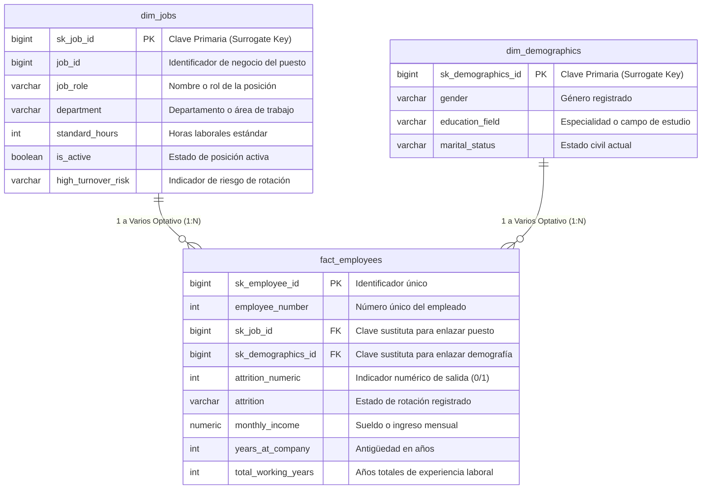

# 📅 Semana 3 - DÍA 21 – DOCUMENTACIÓN ERD

**Autor:** Miguel Angel Rizo Vargas  
**Fecha:** 24/07/2026  
**Programa:** Data Mastery 120 – Roadmap Integral de Minería y Análisis de Datos  

---

## 📌 1. Descripción y Objetivo
El propósito de este proyecto es implementar un **Modelo en Estrella (Star Schema)** relacional para analizar la rotación de personal (attrition), ingresos y métricas demográficas a partir del dataset *IBM HR Analytics Employee Attrition & Performance*.

**Objetivos principales:**
- Definir e implementar la infraestructura relacional en **PostgreSQL** mediante tablas de dimensiones (`dim_jobs`, `dim_demographics`) y una tabla de hechos central (`fact_employees`) utilizando claves sustitutas (`IDENTITY`) e integridad referencial (`FK`, `CASCADE`, `RESTRICT`).
- Generar e integrar diagramas Entidad-Relación (**ERD**) en sintaxis **Mermaid** con Notación Pata de Gallo (Crow's Foot Notation) directamente en la documentación técnica del repositorio.
- Automatizar la extracción del **Diccionario de Datos** desde el catálogo del sistema (`information_schema.columns`) utilizando **Python** y **SQLAlchemy/Pandas**.
- Validar las capas de modelado de datos en **Power BI Desktop** (Vista de Modelo) y **Tableau Desktop** (Capa Lógica con Noodles).

---

## 🛠️ 2. Arquitectura y Tecnologías
- **Base de Datos (ETL/ELT):** PostgreSQL 26.1.0, DBeaver 26.1.0
- **Procesamiento, Análisis y Automatización:** Python 3.14.3, Pandas, SQLAlchemy
- **Visualización y Reportes:** Power BI Desktop (v2.154.956.0 64-bit), Tableau Desktop Free Edition (2026.2.0)
- **Control de Versiones y Entorno:** Git, GitHub, VS Code, Markdown / Mermaid Syntax

---

## 📂 3. Estructura del Repositorio
```text
DM_Roadmap_P1_120D/
│
├── 03_scripts_etl/        # Automatización: Motores de procesamiento para mover datos de 'raw' a 'processed'.
│   ├── sql/               # Código SQL para gestión de tablas y consultas.
│   │   └── day21_erd_documentation/
│   │       ├── day21_star_schema_hr_analytics_definition.sql
│   │       └── day21_get_star_schema_dictionary.sql
│   ├── src/               # Código fuente en Python para extracción, limpieza y Feature Engineering.
│   │   ├── custom_functions/
│   │   │   ├── logging_pipeline.py
│   │   │   └── security_engine.py
│   │   └── day21_erd_documentation/
│   │       ├── day21_generate_markdown_dictionary.py
│   │       └── day21_inf_schema_cols.
│   └── .env.example
│
├── 05_results/            # Salidas estáticas: Reportes finales en formato plano por unidad de negocio.
│   └── screenshots/       # Evidencias visuales, gráficos clave y diagramas para presentaciones.
│       └── rrh/
│           └── day21_erd_documentation/
│               ├── day21_erd_star_schema_crows_foot_notation.png
│               ├── day21_powerbi_model_view.png
│               └── day21_tableau_logical_layer.png
│
├── 10_docs/
│   └── day21_erd_documentation/
│       ├── day21_erd_star_schema.mmd
│       ├── day21_generate_markdown_dictionary.md
│       ├── day21_generate_markdown_dictionary_20261008.md
│       └── day21_README.md
│
├── README.md              # Carta de presentación: Resumen ejecutivo, instalación y arquitectura.
└── requirements.txt       # Entorno global: Listado para replicar todo el ecosistema del proyecto.
```

---

## 🚀 4. Guía de Ejecución Paso a Paso

### Paso 1: Configuración del Entorno de Python
Instale las dependencias requeridas en su entorno virtual Python (v3.14.3):
```bash
pip install -r requirements.txt
```

### Paso 2: Base de Datos y Scripts SQL DDL
1. Configure las variables de entorno en su archivo `.env` para la base de datos `ibm_hr_analytics`.
2. Ejecute los scripts SQL en PostgreSQL (v26.1.0) utilizando DBeaver:
   - `day21_star_schema_hr_analytics_definition.sql` → Creación del esquema en estrella:
     - `dim_jobs`: Dimensión de puestos y departamentos.
     - `dim_demographics`: Dimensión demográfica y perfil educativo.
     - `fact_employees`: Tabla de hechos central con métricas y FKs.

```sql
-- DDL Principal de Construcción del Modelo en Estrella
CREATE TABLE IF NOT EXISTS dim_jobs (
    sk_job_id          BIGINT NOT NULL GENERATED ALWAYS AS IDENTITY,
    job_id             BIGINT NOT NULL,
    job_role           VARCHAR(100) NOT NULL,
    department         VARCHAR(100) NOT NULL,
    standard_hours     INT NOT NULL,
    is_active          BOOLEAN NOT NULL DEFAULT TRUE,
    high_turnover_risk VARCHAR(3),
    CONSTRAINT dim_jobs_pk PRIMARY KEY (sk_job_id)
);

CREATE TABLE IF NOT EXISTS dim_demographics (
    sk_demographics_id BIGINT NOT NULL GENERATED ALWAYS AS IDENTITY,
    gender             VARCHAR(20) NOT NULL,
    education_field    VARCHAR(100) NOT NULL,
    marital_status     VARCHAR(20) NOT NULL,
    CONSTRAINT dim_demographics_pk PRIMARY KEY (sk_demographics_id)
);

CREATE TABLE IF NOT EXISTS fact_employees (
    sk_employee_id     BIGINT NOT NULL GENERATED ALWAYS AS IDENTITY,
    employee_number    INT NOT NULL,
    sk_job_id          BIGINT NOT NULL,
    sk_demographics_id BIGINT NOT NULL,
    attrition_numeric  INT NOT NULL,
    attrition          VARCHAR(5) NOT NULL,
    monthly_income     NUMERIC(10,2) NOT NULL,
    years_at_company   INT NOT NULL,
    total_working_years INT NOT NULL,
    CONSTRAINT fact_employees_pk PRIMARY KEY (sk_employee_id),
    CONSTRAINT fk_dim_jobs FOREIGN KEY (sk_job_id)
        REFERENCES dim_jobs(sk_job_id) ON UPDATE CASCADE ON DELETE RESTRICT,
    CONSTRAINT fk_dim_demographics FOREIGN KEY (sk_demographics_id)
        REFERENCES dim_demographics(sk_demographics_id) ON UPDATE CASCADE ON DELETE RESTRICT
);
```

### Paso 3: Generación Automática del Diccionario de Datos con Python
Ejecute el pipeline de extracción automatizada de metadatos desde `information_schema.columns` hacia Markdown:
```bash
python src/day21_erd_documentation/day21_generate_markdown_dictionary.py
```

---

## 🔍 5. Consultas de Validación, Diagrama ERD y Diccionario de Datos

### Diagrama Entidad-Relación (Mermaid - Notación Pata de Gallo)


### Consultas SQL Clave de Metadatos
```sql
SELECT 
    t.table_name AS "Tabla",
    c.column_name AS "Columna",
    c.data_type AS "Tipo de Dato",
    c.is_nullable AS "Permite Null",
    COALESCE(tc.constraint_type, 'ATTRIBUTE') AS tipo_restriccion
FROM 
    information_schema.tables AS t
JOIN 
    information_schema.columns AS c 
    ON t.table_name = c.table_name AND t.table_schema = c.table_schema
LEFT JOIN 
    information_schema.key_column_usage AS kcu 
    ON c.table_name = kcu.table_name AND c.column_name = kcu.column_name AND c.table_schema = kcu.table_schema
LEFT JOIN 
    information_schema.table_constraints AS tc 
    ON kcu.constraint_name = tc.constraint_name AND kcu.table_schema = tc.table_schema
WHERE 
    t.table_catalog = 'ibm_hr_analytics'
    AND t.table_schema = 'public'
    AND t.table_name IN ('fact_employees', 'dim_jobs', 'dim_demographics')
ORDER BY 
    t.table_name, c.ordinal_position;
```

### 📖 Diccionario de Datos del Modelo en Estrella
*Generado automáticamente por el pipeline de ingeniería de Python.*

| Tabla | Columna | Tipo de Dato | Permite Null | tipo_restriccion |
|---|---|---|---|---|
| **dim_demographics** | `sk_demographics_id` | `bigint` | NO | PRIMARY KEY |
| **dim_demographics** | `gender` | `character varying` | NO | ATTRIBUTE |
| **dim_demographics** | `education_field` | `character varying` | NO | ATTRIBUTE |
| **dim_demographics** | `marital_status` | `character varying` | NO | ATTRIBUTE |
| **dim_jobs** | `sk_job_id` | `bigint` | NO | PRIMARY KEY |
| **dim_jobs** | `job_id` | `bigint` | NO | ATTRIBUTE |
| **dim_jobs** | `job_role` | `character varying` | NO | ATTRIBUTE |
| **dim_jobs** | `department` | `character varying` | NO | ATTRIBUTE |
| **dim_jobs** | `standard_hours` | `integer` | NO | ATTRIBUTE |
| **dim_jobs** | `is_active` | `boolean` | NO | ATTRIBUTE |
| **dim_jobs** | `high_turnover_risk` | `character varying` | YES | ATTRIBUTE |
| **fact_employees** | `sk_employee_id` | `bigint` | NO | PRIMARY KEY |
| **fact_employees** | `employee_number` | `integer` | NO | ATTRIBUTE |
| **fact_employees** | `sk_job_id` | `bigint` | NO | FOREIGN KEY |
| **fact_employees** | `sk_demographics_id` | `bigint` | NO | FOREIGN KEY |
| **fact_employees** | `attrition_numeric` | `integer` | NO | ATTRIBUTE |
| **fact_employees** | `attrition` | `character varying` | NO | ATTRIBUTE |
| **fact_employees** | `monthly_income` | `numeric` | NO | ATTRIBUTE |
| **fact_employees** | `years_at_company` | `integer` | NO | ATTRIBUTE |
| **fact_employees** | `total_working_years` | `integer` | NO | ATTRIBUTE |

---

## 📊 6. Módulo de Visualización (Power BI & Tableau)

### Mapeo en Power BI Desktop
- **Fuente de Datos:** Base de Datos PostgreSQL `ibm_hr_analytics`
- **Modo de Conexión:** Import / DirectQuery
- **Relaciones:** 
  - `dim_jobs[sk_job_id]` (1) ──> `fact_employees[sk_job_id]` (*)
  - `dim_demographics[sk_demographics_id]` (1) ──> `fact_employees[sk_demographics_id]` (*)

### 🔗 Mapeo de Capa Lógica en Tableau Desktop
*El modelo utiliza la **capa lógica** de **Tableau** para preservar la **granularidad nativa** del dataset 'IBM HR Analytics Employee Attrition & Performance', evitando la **duplicación sintética de filas** al calcular ingresos o promedios.*

| Tabla Origen (Fact) | Campo Clave (Fact) | Tabla Dimensión | Campo Clave (Dim) | Tipo de Relación |
|---|---|---|---|---|
| **fact_employees** | `sk_job_id` | **dim_jobs** | `sk_job_id` | Capa Lógica (Noodle / Many-to-One) |
| **fact_employees** | `sk_demographics_id` | **dim_demographics** | `sk_demographics_id` | Capa Lógica (Noodle / Many-to-One) |

- **Acceso a Reportes:** 🔗 *[Enlace al Dashboard de Power BI Service / Tableau Public]*
- **Frecuencia de Actualización:** Diaria automatizada.