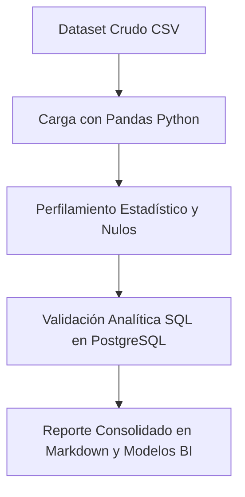

# Documentación Técnica - Día 22: Perfilamiento y Estadística Descriptiva

## Diagrama de Flujo del Proceso Analítico

```mermaid
graph TD
    A[Dataset Crudo CSV] --> B[Carga con Pandas Python]
    B --> C[Perfilamiento Estadístico y Nulos]
    C --> D[Validación Analítica SQL en PostgreSQL]
    D --> E[Reporte Consolidado en Markdown y Modelos BI]
```